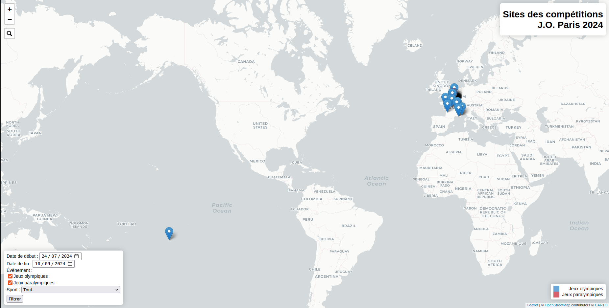

# olympus

A website with an interactive map of the olympics (and para-olympics) competition locations for Paris 2024.



## Installation

You need to have `npm` and `Node.js` installed.

```bash
git clone git@github.com:MiguelLaura/olympus.git
cd olympus
npm install
```

## Usage

```bash
node public/js/getGeojson.js # Download data: to do only once
node app.js # Launch website
```

## Useful links

* [Data used](https://data.paris2024.org/explore/dataset/paris-2024-sites-de-competition/api/)
* [Creating a map](https://leafletjs.com/examples/quick-start/)
* [Web server with node js](https://www.sitepoint.com/build-a-simple-web-server-with-node-js/)
* [Creating layers](https://leafletjs.com/examples/layers-control/)
* [Using GeoJSON](https://leafletjs.com/examples/geojson/)
* [Filtering on properties](https://zestedesavoir.com/tutoriels/4053/leaflet-utilisation-avancee/filtrer-des-donnees/)
